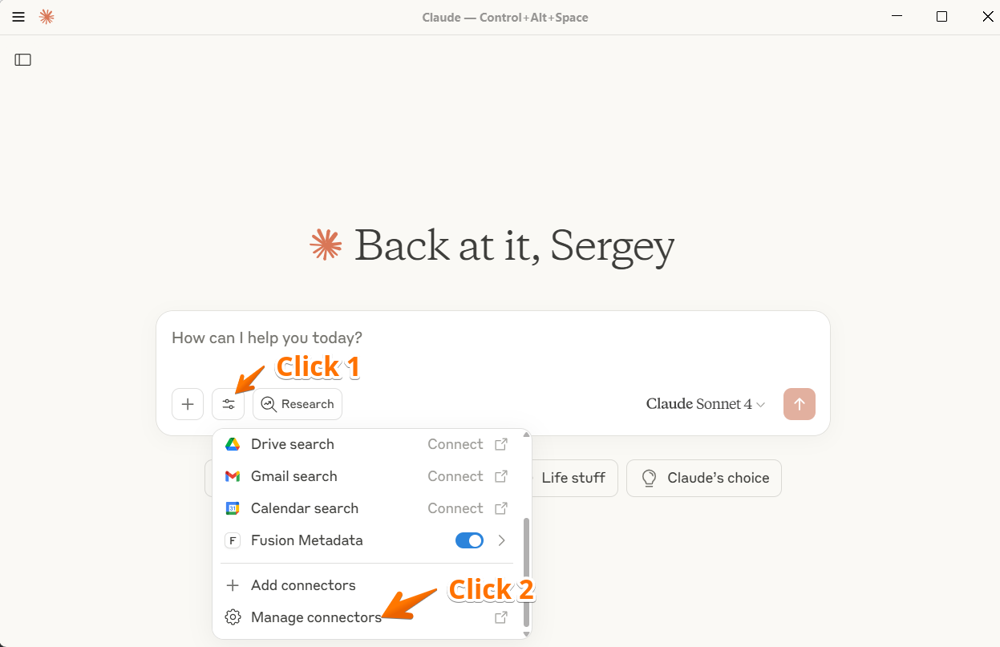
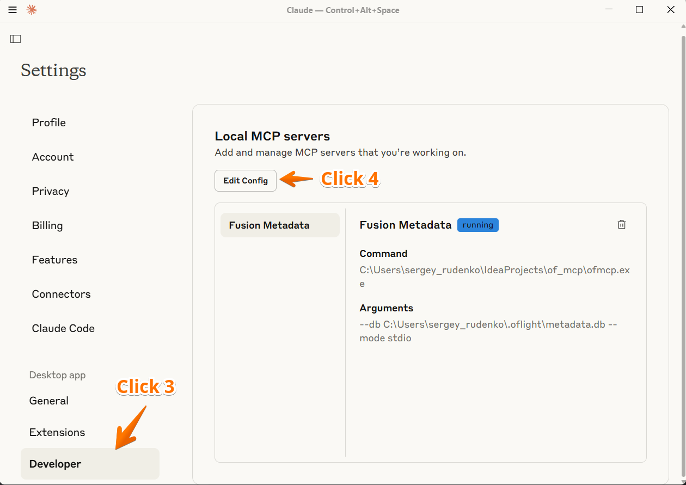
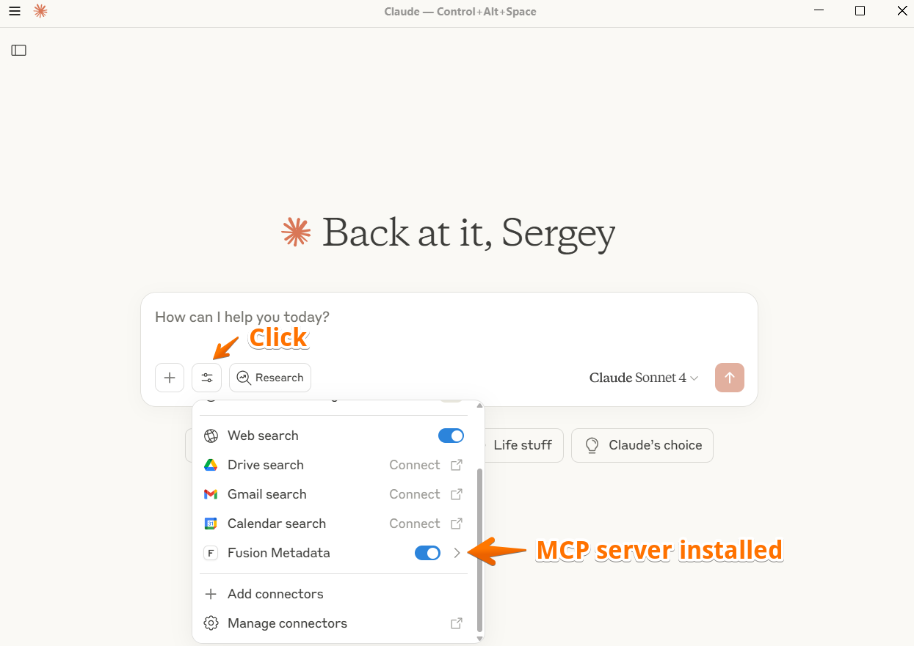
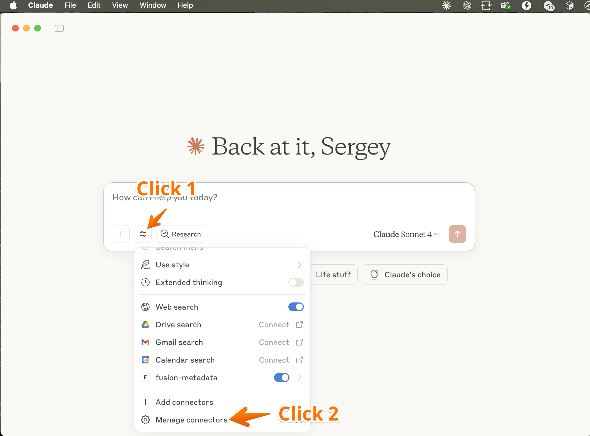
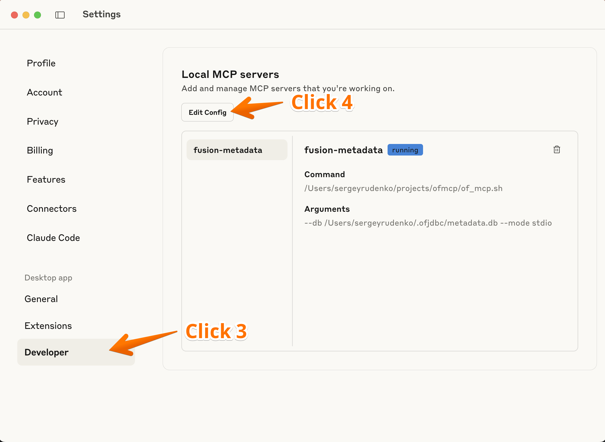
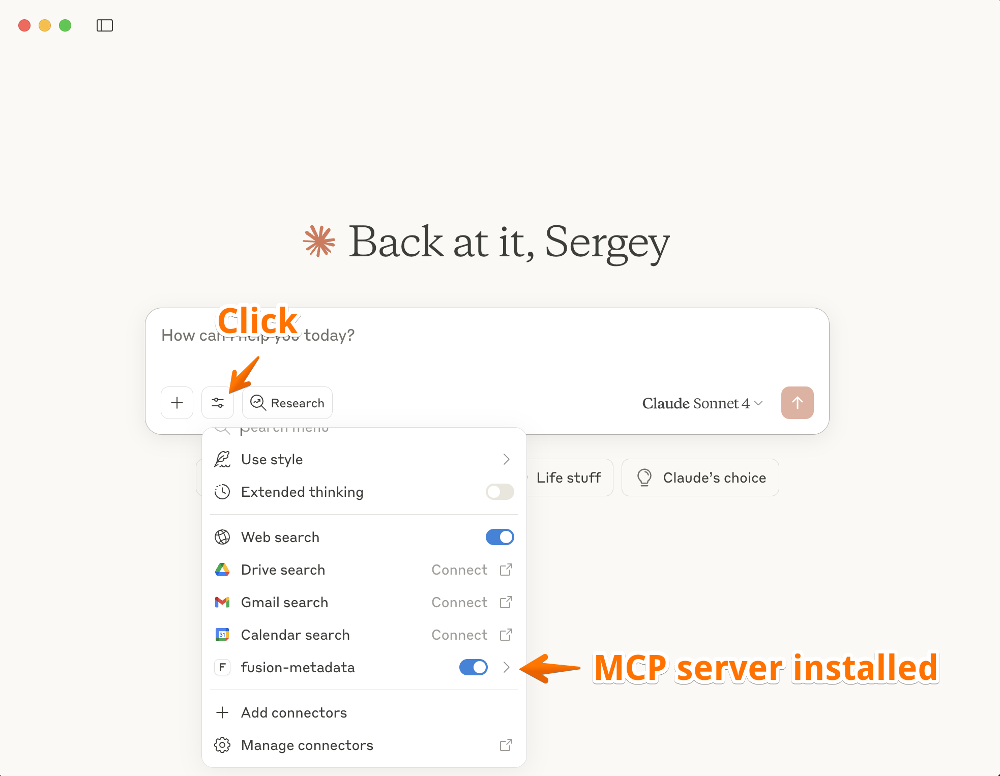

# OFJDBC Claude MCP Server

A Claude Desktop MCP server that provides Oracle Fusion metadata context through OFJDBC and OFARROW integration.

## Overview

This server enhances Claude AI's productivity by retrieving Oracle Fusion metadata from a local DuckDB database, enabling intelligent communication about your database structure and queries.

## Security & Privacy

🔒 **Complete Security Isolation**
- **No Database Access**: This MCP server has **zero** access to your Oracle Fusion database
- **No SQL Results**: Cannot see or access any actual data from your SQL query results
- **No Credentials Required**: Does not need or store any Oracle Fusion login credentials
- **Metadata Only**: Works exclusively with locally cached table/column/index metadata
- **Offline Operation**: Functions independently - DBeaver and OFJDBC don't need to be running

Your sensitive data remains completely secure as Claude only sees database structure information, never the actual content.

### How It Works

1. **Data Collection**: While you write SELECT statements in DBeaver, OFJDBC automatically saves metadata about accessed tables and views to a local DuckDB database
2. **Local Storage**: The metadata file is stored in your user folder at `.oflight/metadata.db` (ensuring complete privacy)
3. **Intelligent Context**: This MCP server feeds that metadata directly into Claude AI, providing context-aware assistance
4. **Progressive Learning**: The system builds knowledge incrementally as you explore your database

### Important Notes

- **Initial Setup**: Only table names and descriptions are saved when you first use OFJDBC in DBeaver
- **Column Information**: Table columns are saved only when you:
   - Write SELECT statements using those tables
   - Manually open tables in the database explorer (left pane)
- **Index Information**: Index details are saved only when you open them in the database explorer
- **Scope**: Claude AI can only access locally stored metadata

### See It In Action

🎥 **Quick Demo**: Watch a [short video demonstration](https://www.youtube.com/watch?v=acgyR3kB6s8) to see the OFJDBC Claude MCP server in action.

## Prerequisites

- **Claude Desktop**: Installed and running
- **OFJDBC**: Already installed and working ([GitHub Repository](https://github.com/krokozyab/ofjdbc))

## Installation

### Windows

1. **Download Required Files**

   Download the following files from the [GitHub Windows release](https://github.com/krokozyab/ofjdbc_claudie_mcp/releases/tag/Windows) to a designated folder on your PC:
   - `ofmcp.exe`
   - `db_worker_safe.exe`
   - `libduckdb.dll`

2. **Open Claude Desktop**

3. **Access Settings**

   

4. **Navigate to Configuration**

   

5. **Edit Configuration File**

   Edit `claude_desktop_config.json` with the following configuration:

   ```json
   {
     "mcpServers": {
       "Fusion Metadata": {
         "command": "C:\\Users\\<your_username>\\<folder_from_step_1>\\ofmcp.exe",
         "args": ["--db", "C:\\Users\\<your_username>\\.oflight\\metadata.db", "--mode", "stdio"]
       }
     }
   }
   ```

   **Note**: Replace `<your_username>` and `<folder_from_step_1>` with your actual username and folder path.

6. **Restart Claude Desktop**

   Save the configuration file and restart Claude Desktop by clicking the menu button (☰) in the top-left corner, then selecting **File → Exit**.

7. **Verify Installation**

   You should see the MCP server connected:

   

8. **First-Time Testing**

   🔧 **Recommended**: For your first test run, close DBeaver to avoid potential database locks on the metadata file.

   ⚠️ **Future Consideration**: In some cases, you may need to close Oracle Fusion connections in DBeaver while working with Claude to prevent database locking issues.

### macOS

1. **Download Required Files**

   Download the following files from the [GitHub macOS release](https://github.com/krokozyab/ofjdbc_claudie_mcp/releases/tag/MacOS) to a designated folder on your Mac:
   - `ofmcp`
   - `ofmcp.sh`
   - `libduckdb.dylib`

2. **Make Files Executable**

   ⚠️ **Important**: Open Terminal and run these commands to make the files executable:

   ```bash
   chmod +x ofmcp
   chmod +x ofmcp.sh
   ```

3. **Open Claude Desktop**

4. **Access Settings**

   

5. **Navigate to Configuration**

   

6. **Edit Configuration File**

   Edit `claude_desktop_config.json` with the following configuration:

   ```json
   {
     "mcpServers": {
       "fusion-metadata": {
         "command": "/Users/<your_username>/<folder_from_step_1>/ofmcp.sh",
         "args": ["--db", "/Users/<your_username>/.ofjdbc/metadata.db", "--mode", "stdio"]
       }
     }
   }
   ```

   **Note**: Replace `<your_username>` and `<folder_from_step_1>` with your actual username and folder path.

7. **Verify Installation**

   You should see the MCP server connected:

   

8. **First-Time Testing**

   🔧 **Recommended**: For your first test run, close DBeaver to avoid potential database locks on the metadata file.

   ⚠️ **Future Consideration**: In some cases, you may need to close Oracle Fusion connections in DBeaver while working with Claude to prevent database locking issues.

## Metadata Database Structure

The local DuckDB database contains three main tables that store your Oracle Fusion metadata:

### CACHED_TABLES
Stores basic information about database tables and views:
- **Schema and Table Information**: Schema name, table name, and table type
- **Documentation**: Table remarks and descriptions
- **Categorization**: Table catalog and type information
- **Unique Identification**: Combination of schema and table name serves as the primary key

### CACHED_COLUMNS
Contains detailed column information for each table:
- **Column Details**: Column name, data type, size, and precision information
- **Position and Constraints**: Ordinal position within the table and nullable constraints
- **Documentation**: Column-level remarks and descriptions
- **Relationships**: Links to parent tables via schema and table name

### CACHED_INDEXES
Stores index information for performance optimization:
- **Index Properties**: Index name, type, and uniqueness information
- **Column Mapping**: Which columns are included in each index and their order
- **Performance Metadata**: Cardinality and page information for query optimization
- **Relationships**: Links indexes to their corresponding tables and columns

### Working with Metadata

When working with Claude, you can reference these table structures to:
- Ask specific questions about table schemas or column types
- Request queries that leverage existing indexes
- Understand relationships between different database objects
- Get help with performance optimization based on available indexes

## Usage

Once installed, Claude AI will have access to your Oracle Fusion metadata and can assist with:

- Writing and optimizing SQL queries
- Understanding table relationships
- Exploring database schema
- Providing context-aware database assistance

The more you use OFJDBC in DBeaver, the more comprehensive Claude's knowledge of your database becomes.

## Support

For issues related to:
- **OFJDBC**: Visit the [OFJDBC GitHub repository](https://github.com/krokozyab/ofjdbc)
- **This MCP Server**: Create an issue in this repository