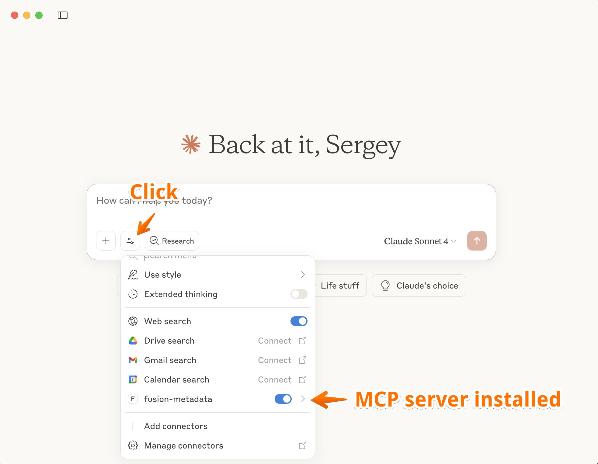

# Installation – macOS

1. **Download Required Files**
   - Download the binaries from the [macOS release](https://github.com/krokozyab/ofjdbc_claudie_mcp/releases/tag/MacOS) into a folder:
     - `ofmcp`
     - `ofmcp.sh`
     - `libduckdb.dylib`

2. **Make the binaries executable**
   ```bash
   chmod +x ofmcp
   chmod +x ofmcp.sh
   ```

3. **Open Claude Desktop**

4. **Access Settings**
   

5. **Navigate to Configuration**
   

6. **Edit the configuration file**
   Update `claude_desktop_config.json` as follows:

   ```json
   {
     "mcpServers": {
       "fusion-metadata": {
         "command": "/Users/<your_username>/<folder_from_step_1>/ofmcp.sh",
         "args": ["--db", "/Users/<your_username>/.ofjdbc/metadata.db", "--mode", "stdio"]
       }
     }
   }
   ```

   Replace `<your_username>` and `<folder_from_step_1>` with the correct values on your Mac.

7. **Verify the connection**
   

8. **First-time testing tips**
   - Close DBeaver during the first run to avoid locking the DuckDB metadata file.
   - If you encounter locking later, disconnect active Oracle Fusion sessions in DBeaver before using Claude.
