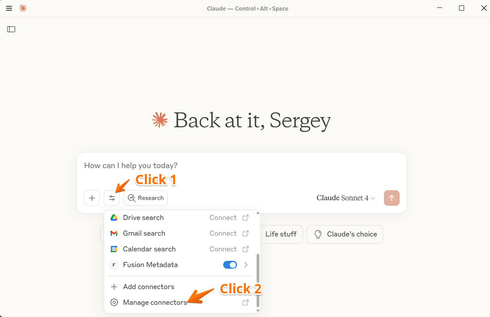
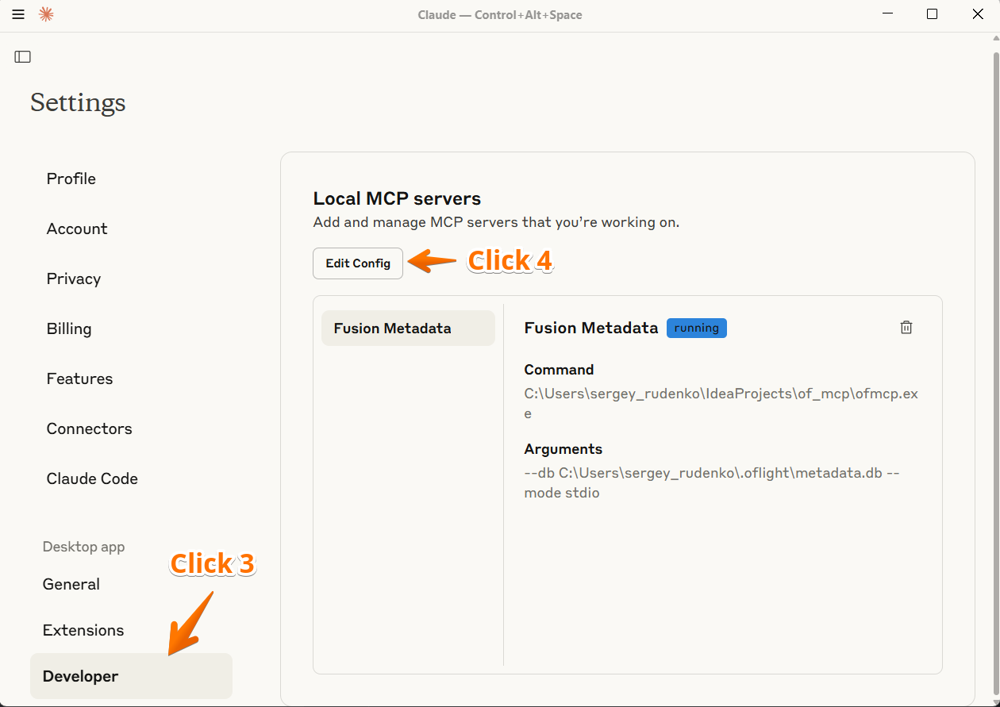

# Installation – Windows

1. **Download Required Files**
   - Download the binaries from the [Windows release](https://github.com/krokozyab/ofjdbc_claudie_mcp/releases/tag/Windows) into a dedicated folder:
     - `ofmcp.exe`
     - `db_worker_safe.exe`
     - `libduckdb.dll`

2. **Open Claude Desktop**

3. **Access Settings**
   

4. **Navigate to Configuration**
   

5. **Edit the configuration file**
   Update `claude_desktop_config.json` with the correct paths:

   ```json
   {
     "mcpServers": {
       "Fusion Metadata": {
         "command": "C:\\Users\\<your_username>\\<folder_from_step_1>\\ofmcp.exe",
         "args": ["--db", "C:\\Users\\<your_username>\\.oflight\\metadata.db", "--mode", "stdio"]
       }
     }
   }
   ```

   Replace `<your_username>` and `<folder_from_step_1>` with values that match your environment.

6. **Restart Claude Desktop**
   Save the file and restart Claude Desktop (☰ → File → Exit).

7. **Verify the connection**
   

8. **First-time testing tips**
   - Close DBeaver during the first run to avoid locking the DuckDB metadata file.
   - If you encounter locking later, disconnect Oracle Fusion sessions in DBeaver before interacting with Claude.
